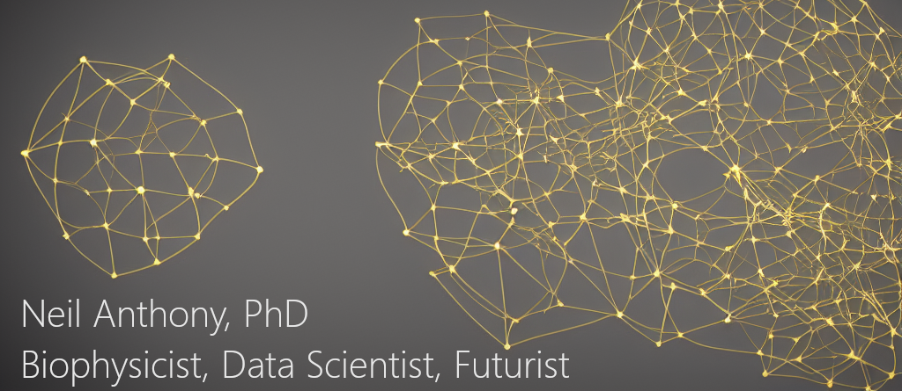

# Get in Touch

# Technologies
<!-- Change name of heading -->

| Type | Skills     |
| :------------- | :------------- |
| Programming Languages       |  |
| Data Science & Machine Learning | |
| Data Visualization | |
| Cloud |  
| Databases | |
| ORMs & ODMs | 
| Design | 
| Other Tools | |